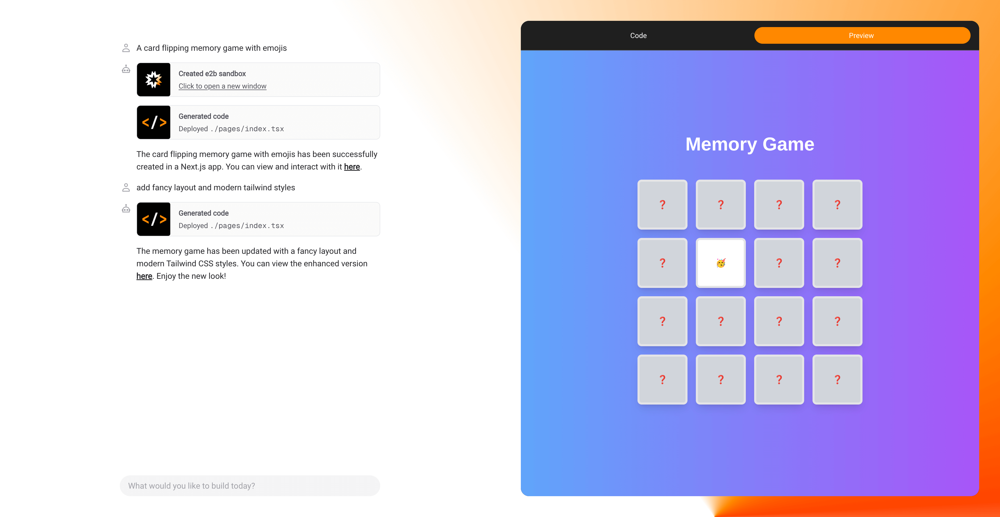

<h1 align="center">e0</h1>

<p align="center">A simple open-source AI agent that can generate and deploy an app in seconds.
</p>



## Featuring

- Next.js 15
- Vercel AI SDK 4.1.54:
  - OpenAI `gpt-4o-mini` for code generation ([add your own model](#customize-the-model))
  - Code streaming (based on the latest `toolCallStreaming`)
- Fast and secure code interpretation via [E2B SDK](https://github.com/e2b-dev/code-interpreter) by [E2B](https://e2b.dev)
- A set of pre-built tools for your agent to use ([add your own](#add-your-own-tools))
- Monaco editor for multi-file code preview

## Install locally

### Prerequisites

git, Node.js 16+, pnpm

### Getting started

Clone the repository:

```bash
git clone git@github.com:mkrl/e0.git
```

Obtain API keys from OpenAI and E2B Dashboard.

Set the required environment variables as shown in the `.env.example` file, but in a new file called `.env`.

Install dependencies:

```bash
pnpm install
```

Launch the development server:

```bash
pnpm run dev
```

## Customize the model

Thanks to the Vercel AI SDK, you can hot-swap the [underlying model](https://sdk.vercel.ai/docs/foundations/providers-and-models) for code generation.

You can pick just about anything that is capable of "Tool Usage" [here](https://sdk.vercel.ai/docs/foundations/providers-and-models#model-capabilities).

1. Obtain an API key (if that's something different from the default OpenAI provider)
2. Set an environment variable for your new model in the `.env` file
3. Go to `app/api/chat/route.ts` and change the `model` variable to your new model

## Tool Calling

The chatbot follows an agentic approach: an LLM is given a set of tools and instructions on how to operate on a remote server.

The following tools are available:

- Create a sandbox server
- Generate and deploy a file at a particular path
- Install a package

You can find the tools in the `tools` directory, connected to the `streamText` call in `app/api/chat/route.ts`

All the tool calls are streamed in to the client in order to deliver fast intermediate results.

### Add your own tools

1. Think of a good idea! Generate an image and deploy it to the sandbox? Check weather in NY to make sure it's not raining when generating code?
2. Create a new file in the `tools` directory by copying the contents of any other tool file
3. Give your tool a good description and a set of arguments. If you want to execute something in a sandbox be sure to include the `sandboxId` parameter
4. Add your tool to the `tools` object in `app/api/chat/route.ts`
5. Add your tool name to `types/tools.ts`
6. Give it some visual appearance in the chat by extending `components/ui/ToolCall.tsx`. You can add a custom icon and messages for all the possible states of the tool call.

### Tweaking the prompt

You can find a full system prompt in `app/api/chat/route.ts`. 

When adding new tools sometimes it is a good idea to give some instructions to the LLM on when to use it. For example, if you only want to generate code when it is not raining in NY, you may want to specify this in a system prompt.